# QuickJobs

**AI-powered job matching platform that connects talent with job opportunities through WhatsApp**


## Table of Contents

1. [Introduction](#1-introduction)
2. [Architecture](#2-architecture)
3. [Microservices](#3-microservices)
4. [User Interface](#4-user-interface)
5. [Deployment](#5-deployment)

---

## 1. Introduction

Recruitment today is broken. Job seekers spend hours searching through listings while companies struggle to reach the right candidates. QuickJobs is a smart, WhatsApp-based job matching platform built to fix that.

QuickJobs is a **distributed, push-based job matching platform** that automatically delivers relevant job alerts to candidates via WhatsApp. No searching is required. Instead of candidates pulling job listings, the system pushes the right opportunity to the right person at the right time.

### Core Features

- **WhatsApp onboarding**: Job seekers register their profile once by sending a WhatsApp message. A conversational state machine collects their name, skills, location and CV.
- **CV processing**: Candidates upload their CV (PDF or DOCX) directly in WhatsApp. Text is extracted automatically, including OCR for scanned documents.
- **AI-powered matching**: CVs and job descriptions are converted into vector embeddings and matched using cosine similarity, capturing semantic meaning rather than exact keywords.
- **Real-time notifications**: Matched candidates receive a WhatsApp alert within seconds of a job being posted.
- **Employer web portal**: Companies register, post jobs, and view ranked matched candidates through a Next.js dashboard.
- **Admin panel**: Admins approve or reject company registrations and monitor platform-wide statistics.
- **Privacy compliance (PDPA)**: Candidates can opt out with STOP or erase all their data with DELETE MY DATA at any time.

### Main Actors

1. **Job Seekers** - interact entirely via WhatsApp
2. **Employers** - post and manage jobs via the web portal
3. **Admin** - manages company approvals and platform statistics

The overall goal is to transform recruitment from a manual, pull-based model into an automated, push-driven distributed system that is scalable, fault tolerant and reliable.

---

## 2. Architecture

### 2.1 Architectural Diagram

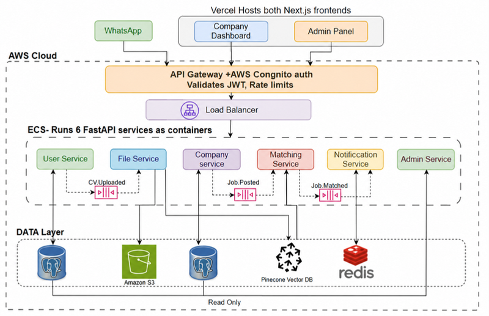

Traffic flow: WhatsApp webhooks and the two Vercel/Amplify-hosted Next.js frontends enter through **AWS API Gateway** (Cognito JWT validation and rate limiting), pass through an **Application Load Balancer**, and reach **six FastAPI microservices** running as containers on **AWS ECS**. Services communicate asynchronously through **Amazon SQS** queues (`cv-uploaded`, `job-posted`, `job-matched`). The data layer consists of **PostgreSQL** (per-service databases), **Amazon S3** (CV files), **Pinecone** (vector embeddings) and **Redis** (conversation state, opt-in cache, deduplication).

### 2.2 Design Decisions

**Decision 1: Microservices + Event-Driven Architecture (EDA)**

The application is split into six independent services rather than a monolith, for three reasons:

- **Independent scalability**: The Matching Service can scale alone during job-posting spikes without scaling the whole system.
- **Fault isolation**: A Notification Service failure does not crash the User or Matching services.
- **Team autonomy**: Each service can be developed, deployed and updated independently by different team members.

Services are decoupled through events rather than tight synchronous coupling:

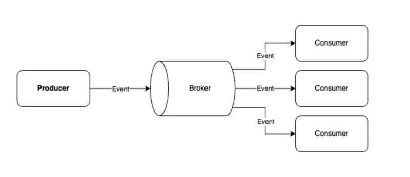

- **Async processing**: SQS queues decouple producers from consumers.
- **Real-time pipeline**: `CV.Uploaded`, `Job.Posted` and `Job.Matched` events flow automatically through the system.
- **No data loss**: If the Notification Service is down, events queue up in SQS and are replayed when it recovers. Dead-letter queues capture repeatedly failing messages.

**Decision 2: How each service contributes**

| Service | Contribution to overall functionality |
|---|---|
| WhatsApp Gateway | Candidate entry point; runs the onboarding conversation state machine |
| User Service | Single source of truth for candidate profiles, skills and opt-in status |
| File Service | Receives CVs, extracts text, stores files in S3, publishes `cv-uploaded` events |
| Company Service | Company registration, admin approval workflow and job posting; triggers matching |
| Matching Service | Embeds CVs and jobs into vectors and runs cosine-similarity matching |
| Notification Service | Consumes `job-matched` events and sends WhatsApp alerts via the Meta API |

**Decision 3: Database per service**

Each microservice owns its own database with no cross-service direct DB access. This prevents tight coupling and allows independent schema changes and scaling.

- **PostgreSQL**: structured, relational data needing strong consistency (profiles, companies, jobs)
- **Amazon S3**: binary files (PDF, DOCX CVs)
- **Pinecone**: high accuracy and performance for high-dimensional vector retrieval
- **Redis**: fast key-value lookups for conversation state, opt-in caching and notification deduplication

**Decision 4: Zero Trust security boundary**

All traffic enters via API Gateway + Cognito with JWT validated at the edge. Every route and service is protected with role-based access control (RBAC), so, for example, a normal user cannot access an admin endpoint.

**Architectural trade-offs considered**

| Decision | Trade-off | Mitigation |
|---|---|---|
| Microservices | Higher operational complexity vs monolith | CI/CD pipelines; service mesh (future) |
| Eventual consistency | Data may briefly lag across services | Accepted for the notification use case |
| WhatsApp API dependency | Platform risk if Meta changes policies | SMS fallback channel planned |
| Pinecone Vector DB | Per-query cost increases at scale | OpenSearch as open-source fallback |

---

## 3. Microservices

### 3.1 Implementation Methods

All six services are implemented as **Python 3.11 + FastAPI** applications, containerised with **Docker** and deployed on **AWS ECS**. Rather than the classic Netflix OSS stack, this project uses the equivalent AWS-managed services, which provide the same distributed-systems capabilities without self-hosting the infrastructure:

| Concern | Netflix OSS component | Equivalent used in QuickJobs |
|---|---|---|
| API Gateway / edge routing | Zuul | AWS API Gateway |
| Service discovery and registration | Eureka | AWS ECS service discovery + ALB target groups |
| Client-side load balancing | Ribbon | AWS Application Load Balancer |
| Fault tolerance / circuit breaking | Hystrix | SQS queues with dead-letter queues and retries |
| Monitoring | Atlas / Turbine | Amazon CloudWatch + X-Ray |

Each service exposes a REST interface (documented automatically by FastAPI's OpenAPI/Swagger), owns its own data store, and communicates with other services either synchronously over HTTP (when an immediate response is required) or asynchronously through Amazon SQS (for heavy, decoupled work).

**Services at a glance**

| Service | Port | Data Store | Core Responsibility |
|---|---|---|---|
| WhatsApp Gateway | 8000 | Redis (state) | Candidate entry point; onboarding conversation state machine |
| User Service | 8001 | PostgreSQL | Source of truth for candidate profiles, skills, opt-in status |
| File Service | 8002 | PostgreSQL + S3 | Receives CVs, extracts text, stores files, publishes `cv-uploaded` |
| Company Service | 8003 | PostgreSQL | Company registration, admin approval workflow, job posting |
| Matching Service | 8004 | Pinecone | Embeds CVs and jobs into vectors, runs cosine-similarity matching |
| Notification Service | 8005 | Redis (read-only) | Watches `job-matched` queue, sends WhatsApp alerts via Meta API |

### 3.2 Core Services

#### 3.2.1 WhatsApp Gateway (Port 8000)

**Functionality**: The candidate-facing entry point. It receives Meta webhook events and runs a per-phone conversation state machine (`IDLE → AWAITING_NAME → ... → ACTIVE`) that walks new candidates through onboarding. It downloads uploaded CV media from the Meta Graph API and forwards it for processing, handles `STOP` / `START` opt-out and opt-in commands and `DELETE MY DATA` (PDPA) requests, and persists conversation state in Redis keyed by phone number.

**REST API endpoints**

| Method | Endpoint | Description |
|---|---|---|
| GET | `/webhook` | Meta webhook verification handshake |
| POST | `/webhook` | Receives incoming WhatsApp messages and media events |
| GET | `/health` | Liveness check used by the load balancer |
| GET | `/docs` | Auto-generated Swagger UI (OpenAPI schema at `/openapi.json`) |

**Inter-service interactions**

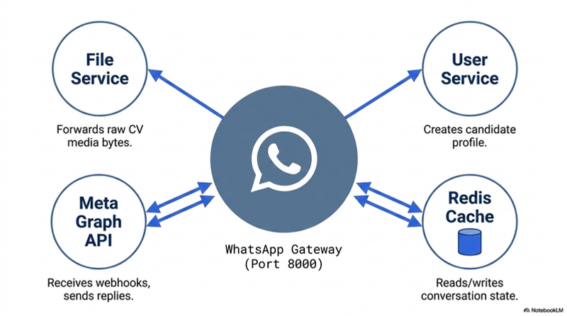

- Calls **User Service** to create the candidate profile once onboarding completes
- Forwards raw CV media bytes to **File Service**
- Reads/writes conversation state in **Redis**
- Receives webhooks from and sends replies via the **Meta Graph API**

#### 3.2.2 User Service (Port 8001)

**Functionality**: The single source of truth for candidate data. It creates the candidate profile once WhatsApp onboarding completes, applies profile updates (skills, location, salary) from the WhatsApp menu, stores the CV's S3 key once the File Service uploads it, caches opt-in status in Redis (7-day TTL) for fast notification checks, and handles PDPA deletion by permanently removing a candidate's record.

**REST API endpoints**

| Method | Endpoint | Description |
|---|---|---|
| POST | `/users` | Create a candidate profile |
| GET | `/users/{phone}` | Fetch a candidate profile |
| PATCH | `/users/{phone}` | Update profile fields (skills, location, salary) |
| PATCH | `/users/{phone}/opt-out` | Unsubscribe candidate from alerts |
| PATCH | `/users/{phone}/opt-in` | Re-subscribe candidate to alerts |
| DELETE | `/users/{phone}` | PDPA deletion of all candidate data |

**Inter-service interactions**

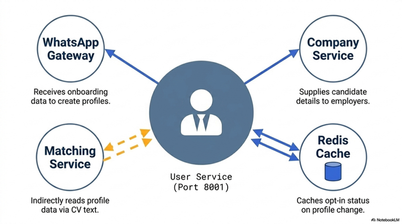

- Receives onboarding data from the **WhatsApp Gateway** to create profiles
- Supplies matched candidate details to the **Company Service** for the employer dashboard
- Caches opt-in status in **Redis** on every profile change
- **Matching Service** indirectly reads profile data via extracted CV text

#### 3.2.3 File Service (Port 8002)

**Functionality**: Handles all CV documents. It receives raw CV bytes (PDF/DOCX) forwarded from the WhatsApp Gateway, extracts text using PyMuPDF for digital PDFs, pytesseract OCR for scanned documents and python-docx for Word files, uploads the file to S3 under `candidates/{phone}/cv_v{version}` (keeping a maximum of 3 versions), and publishes a `cv-uploaded` SQS event so the Matching Service can embed the CV.

**REST API endpoints**

| Method | Endpoint | Description |
|---|---|---|
| POST | `/cv/upload/{phone}` | Upload and process a CV |
| GET | `/cv/{phone}/latest/download` | Get a presigned S3 URL for the latest CV |
| GET | `/cv/{phone}/versions` | List stored CV versions |
| DELETE | `/cv/{phone}` | PDPA deletion of all CV files |

**Inter-service interactions**

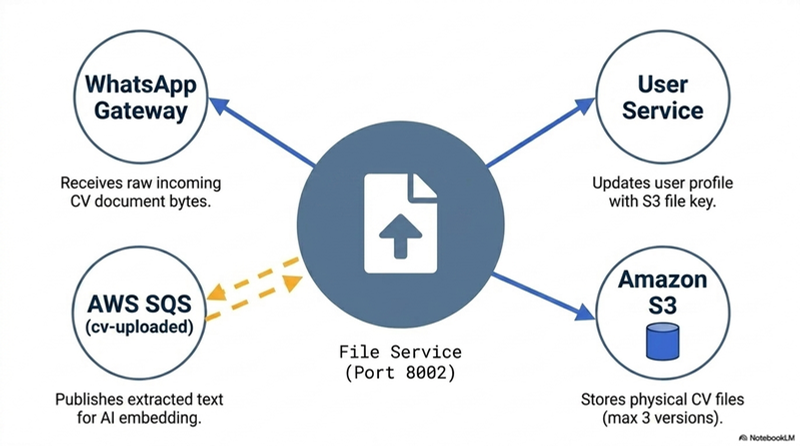

- Receives raw CV bytes from the **WhatsApp Gateway**
- Updates the **User Service** with the S3 file key
- Stores physical files in **Amazon S3**
- Publishes extracted text to the **`cv-uploaded` SQS queue** for AI embedding

#### 3.2.4 Company Service (Port 8003)

**Functionality**: Manages employer companies and job listings. It handles company registration and the `PENDING → APPROVED / REJECTED / SUSPENDED` admin approval workflow, job posting, closing, reopening and deletion. It triggers the AI matching pipeline whenever a job is posted and serves platform-wide statistics to the Admin Panel.

**REST API endpoints**

| Method | Endpoint | Description |
|---|---|---|
| POST | `/companies` | Register a new company |
| GET | `/companies/by-user/{cognito_user_id}` | Get company by Cognito user |
| GET | `/companies/{company_id}` | Get company details |
| POST | `/companies/{company_id}/jobs` | Post a job (triggers embed + match + notify) |
| GET | `/companies/{company_id}/jobs` | List a company's jobs |
| PATCH | `/jobs/{job_id}/status` | Close or reopen a job |
| DELETE | `/jobs/{job_id}` | Delete a job posting |
| GET | `/jobs/{job_id}/matches` | Get ranked matched candidates for a job |
| PATCH | `/admin/companies/{id}/activate` | Admin approves a company |
| GET | `/admin/stats` | Platform-wide KPIs for the Admin Panel |

**Inter-service interactions**

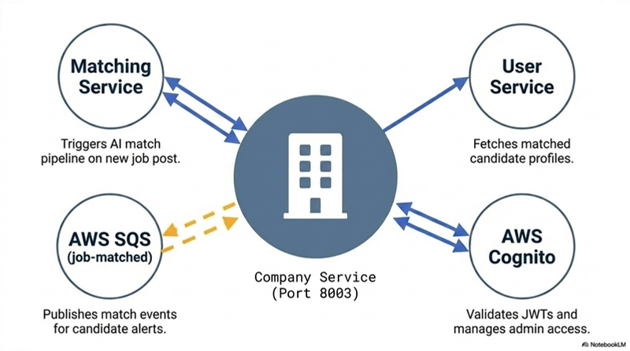

- Calls the **Matching Service** synchronously to trigger the AI match pipeline on each new job post
- Fetches matched candidate profiles from the **User Service** for the employer dashboard
- Publishes match events to the **`job-matched` SQS queue** for candidate alerts
- Validates JWTs and manages admin access via **AWS Cognito**

#### 3.2.5 Matching Service (Port 8004)

**Functionality**: The AI core of the platform. It converts CV text and job descriptions into 384-dimension vectors with Sentence-Transformers (`all-MiniLM-L6-v2`), stores vectors in Pinecone and runs cosine-similarity search (threshold ≈ 0.65). Matching runs in both directions: Job → Candidates when a job is posted, and Candidate → Jobs when a CV is uploaded. A background thread continuously polls the `cv-uploaded` SQS queue.

**REST API endpoints**

| Method | Endpoint | Description |
|---|---|---|
| POST | `/embed/job` | Embed and store a job vector |
| POST | `/embed/{phone}` | Embed and store a candidate CV vector |
| POST | `/match/job` | Find matching candidates for a job |
| POST | `/match/candidate` | Find matching jobs for a candidate |
| DELETE | `/embed/job/{id}` | Remove a job vector |
| GET | `/index/stats` | Pinecone index statistics |

**Inter-service interactions**

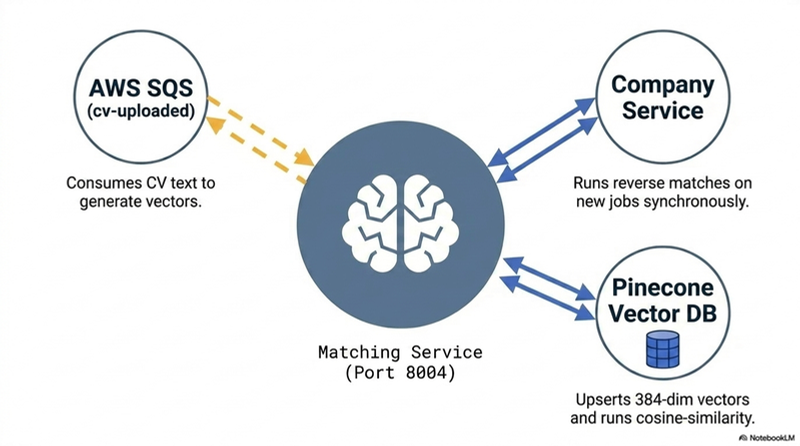

- Consumes CV text from the **`cv-uploaded` SQS queue** to generate vectors
- Serves synchronous reverse-match requests from the **Company Service** on new job posts
- Upserts 384-dim vectors into **Pinecone** and runs cosine-similarity queries

#### 3.2.6 Notification Service (Port 8005)

**Functionality**: A fully decoupled, event-driven dispatcher. It continuously polls the `job-matched` SQS queue in a background thread. Before sending, it checks Redis `opt_in:{phone}` (skip if the candidate opted out) and `notified:{job_id}:{phone}` (skip if already alerted, preventing duplicates). It then sends the WhatsApp match notification via the Meta Graph API and sets a 7-day TTL deduplication key in Redis after every successful send. This service executes zero direct HTTP calls to other QuickJobs services.

**Interface**

| Type | Endpoint / Step | Description |
|---|---|---|
| GET | `/health` | Liveness check |
| GET | `/docs` | Auto-generated Swagger UI (OpenAPI schema at `/openapi.json`) |
| Event | Consume `job-matched` from SQS | Trigger for every match notification |
| Event | Check Redis `opt_in:{phone}` | Skip if the candidate opted out |
| Event | Check Redis `notified:{job_id}:{phone}` | Skip if already notified (dedup) |
| Event | Send WhatsApp alert via Meta Graph API | Deliver the match to the candidate |

**Inter-service interactions**

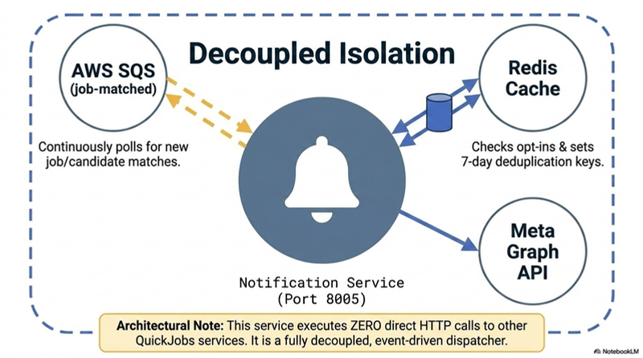

### 3.3 Discovery Server (Service Registration and Monitoring)

Instead of a self-hosted Netflix Eureka server, QuickJobs uses **AWS ECS service discovery together with Application Load Balancer target groups**, which provide the same registration and health-monitoring behaviour as a managed service:

- **Registration**: When ECS launches a new container task for any of the six services, the task is automatically registered into the corresponding ALB target group with its private IP and port. Nothing is configured manually inside the service; the ECS service definition handles registration, exactly as a Eureka client would self-register on startup.
- **Monitoring (health checks)**: The ALB continuously calls each task's `GET /health` endpoint. This replaces Eureka's heartbeat mechanism. A task that fails consecutive health checks is marked unhealthy.
- **Deregistration and self-healing**: Unhealthy tasks are automatically drained and deregistered from the target group so no traffic reaches them, and the ECS scheduler replaces them with fresh containers to maintain the desired task count.
- **Routing**: Because the registry (target group) is always current, the load balancer only ever routes requests to healthy, registered instances, even while services scale in and out.

### 3.4 API Gateway

**Role in the system**: AWS API Gateway is the single entry point for all external traffic (WhatsApp webhooks, the Employer Dashboard and the Admin Panel). Nothing reaches a microservice without passing through it.

**Configurations used**:

- **Cognito JWT authoriser**: API Gateway validates the JWT issued by AWS Cognito at the edge, before any request reaches a service. Invalid or missing tokens are rejected immediately.
- **Rate limiting**: Throttling rules prevent any single user or company from overloading the system, acting as the first line of defence at scale.
- **Proxy route integrations**: Routes such as `/admin/{proxy+}` forward matched paths to the correct backend integration, keeping routing configuration in one place.
- **RBAC enforcement**: Routes are protected by role, so a normal user cannot invoke admin endpoints.
- **Load balancing behind the gateway**: The gateway forwards traffic to an internet-facing Application Load Balancer (`quickjobs-alb`), which distributes requests across the ECS containers in two availability zones.

Deployed API Gateway routes (`quickjobs-api`):

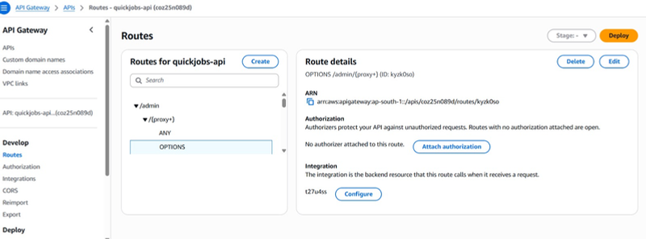

Application Load Balancer (`quickjobs-alb`) distributing traffic across ECS containers:

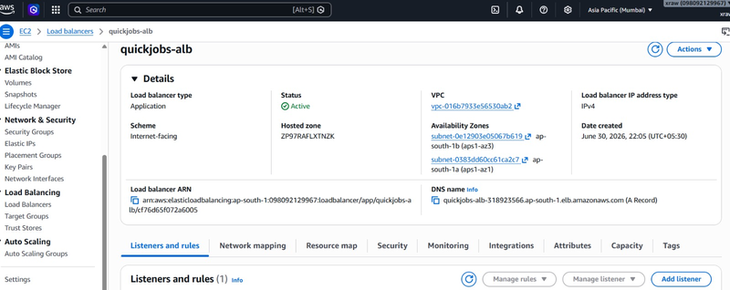

---

## 4. User Interface

### 4.1 Implementation Details

QuickJobs has three user-facing interfaces:

1. **WhatsApp (Job Seekers)**: No separate app is required. Candidates interact entirely through a WhatsApp conversation powered by the Meta WhatsApp Cloud API (v18.0). The gateway's state machine guides them through registration, CV upload, profile updates and opt-in/opt-out commands.

<p align="center">
  <video src="docs/images/whatsapp-demo.mp4" width="320" controls></video>
</p>

2. **Employer Dashboard (Next.js 14)**: Built with **Next.js 14, TypeScript and Tailwind CSS**, deployed on **AWS Amplify**. Employers register their company, post jobs with skill requirements, manage postings and view ranked matched candidates. Login uses **AWS Amplify Auth**, which integrates with Cognito for seamless JWT-based sessions.
   - Live: https://production.d1jd2yt3j6ryo.amplifyapp.com/login

3. **Admin Panel (Next.js 14)**: A separate Next.js application, also on Amplify, where admins approve or reject company registrations and view platform-wide KPIs served by the Company Service's `/admin/stats` endpoint.
   - Live: https://production.d3175lbd78q5v2.amplifyapp.com/login

### 4.2 API Testing Tools

Two complementary approaches were used to test the application's APIs:

**Swagger UI (FastAPI `/docs`)**: Every FastAPI service auto-generates an interactive OpenAPI (Swagger) interface. This was used for API-level testing during development: sending requests and inspecting responses per endpoint, exactly as one would with Postman, but generated directly from the service code so the documentation can never drift from the implementation.

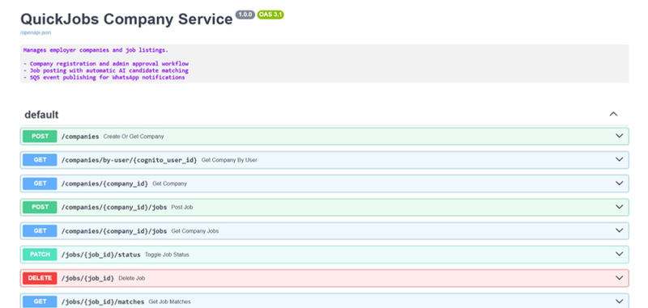

**Automated tests (pytest)**: Automated test cases were written for each service to validate endpoint behaviour and catch regressions. For example, the Matching Service suite runs 26 tests covering embedding, matching and queue-consumption logic.

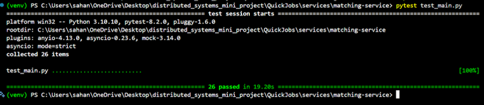

---

## 5. Deployment

The entire platform is deployed on AWS in the ap-south-1 (Mumbai) region, using managed services so that no servers are maintained manually.

### 5.1 Containers: AWS ECS + ECR

Each of the six FastAPI services is packaged as a Docker image and pushed to its own private Amazon ECR repository (for example `quickjobs/user-service`, `quickjobs/matching-service`). The images are then run as tasks inside a single ECS cluster, with one ECS service per microservice keeping the desired number of tasks running at all times. If a container crashes or fails its health check, ECS automatically replaces it, giving the system self-healing behaviour without manual intervention.

### 5.2 Traffic: API Gateway + Application Load Balancer

All external traffic enters through AWS API Gateway, where Cognito JWTs are validated and rate limits are applied at the edge. Valid requests are forwarded to an internet-facing Application Load Balancer (quickjobs-alb) spanning two availability zones, which distributes the load across the healthy ECS containers using continuous health checks on each service's `/health` endpoint.

### 5.3 Messaging: Amazon SQS

Asynchronous communication between services runs on Amazon SQS standard queues with server-side encryption. Three main queues carry the event pipeline (quickjobs-cv-uploaded, quickjobs-job-posted, quickjobs-job-matched), and each is paired with a dead-letter queue so that repeatedly failing messages are captured for inspection rather than lost. This means, for example, that if the Notification Service is temporarily down, match events simply wait in the queue and are processed when it recovers.

### 5.4 Data Layer

- **Amazon RDS (PostgreSQL)** stores structured relational data (candidate profiles, companies, jobs) with Multi-AZ failover for high availability.
- **Amazon S3** stores the binary CV files (PDF/DOCX), keeping up to three versions per candidate.
- **Amazon ElastiCache (Redis)** provides sub-millisecond lookups for WhatsApp conversation state, opt-in status caching and notification deduplication keys.
- **Pinecone** (external managed service) stores the 384-dimension CV and job vectors used for cosine-similarity matching.

### 5.5 Frontends: AWS Amplify

Both Next.js applications (the Employer Dashboard and the Admin Panel) are deployed through AWS Amplify, connected to the production branch of the repository. Every push triggers an automatic build and deployment, and Amplify Auth integrates directly with Cognito for login.

### 5.6 Authentication: AWS Cognito

AWS Cognito manages employer and admin sign-up, login, token issuance and password reset. JWTs issued by Cognito are validated at the API Gateway before any request reaches a microservice, so no custom auth server had to be built or scaled.

### 5.7 Monitoring: CloudWatch

All services stream logs to Amazon CloudWatch, which was also used during development to verify that each service could publish and consume SQS messages correctly and to trace events end to end across services.

### 5.8 Local Development

For local development, the repository includes infra/docker-compose.yml, which spins up all six services with a single command:

​```bash
docker compose -f infra/docker-compose.yml up --build
​```

### Repository Structure

```
QuickJobs/
├── .github/workflows/        # CI/CD pipelines
├── frontend/
│   ├── admin-panel/           # Next.js Admin Panel
│   └── employer-dashboard/    # Next.js Employer Dashboard
├── infra/
│   └── docker-compose.yml     # Local development stack
├── services/
│   ├── company-service/
│   ├── file-service/
│   ├── matching-service/
│   ├── notification-service/
│   ├── user-service/
│   └── whatsapp-gateway/
├── docs/images/               # README images
├── .env.example
└── README.md
```

---
**Live Demo:**
- Employer Dashboard: https://production.d1jd2yt3j6ryo.amplifyapp.com/login
- Admin Panel: https://production.d3175lbd78q5v2.amplifyapp.com/login

---
## References

1. Meta Platforms, Inc., "WhatsApp Business Platform Documentation." https://developers.facebook.com/docs/whatsapp
2. Amazon Web Services, "AWS Documentation." https://docs.aws.amazon.com/
3. Vercel Inc., "Next.js Documentation." https://nextjs.org/docs
4. FastAPI, "FastAPI Documentation." https://fastapi.tiangolo.com/
